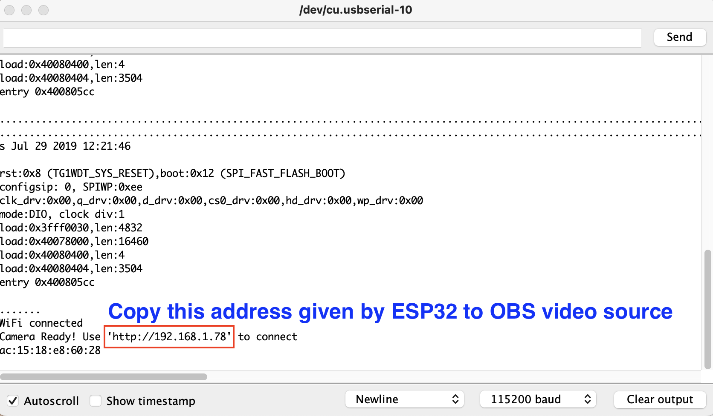
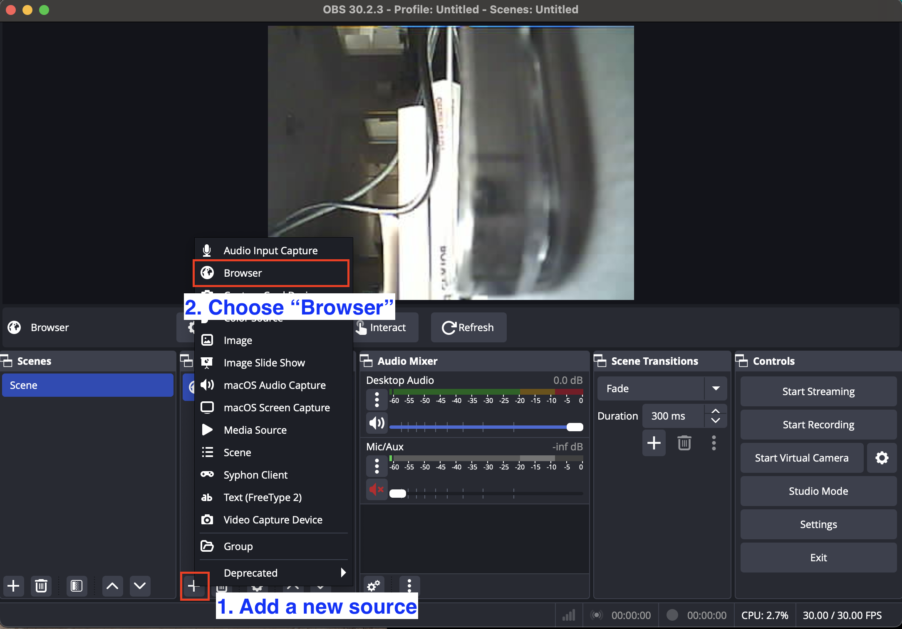
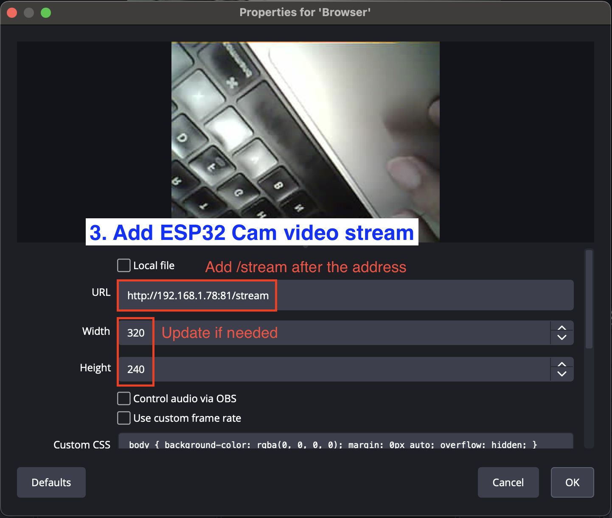
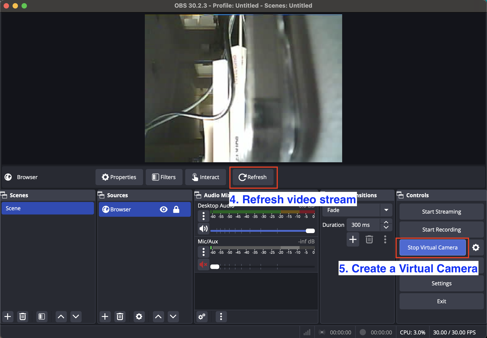
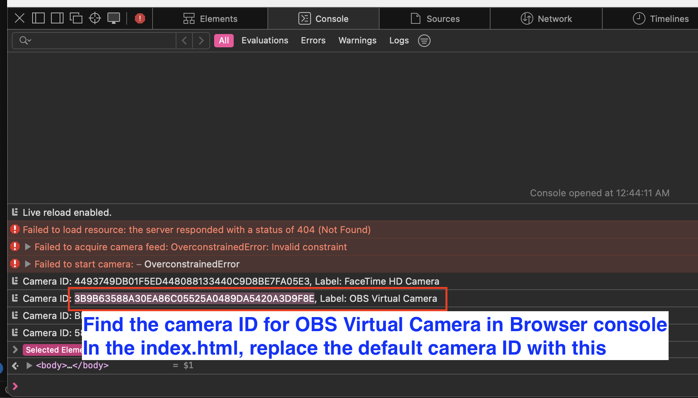
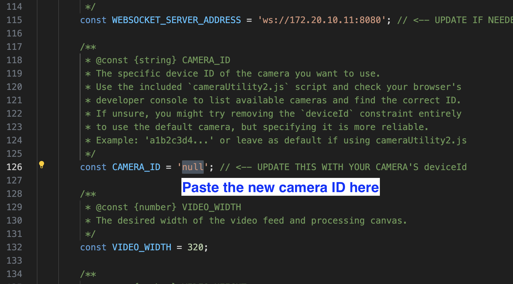
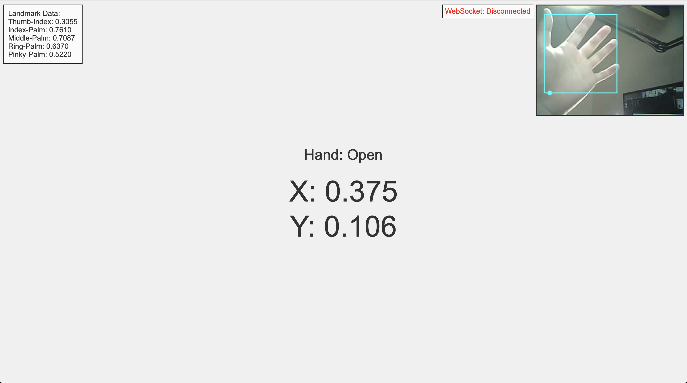

# ESP32-CAM Video Stream to MediaPipe Hand Tracking via OBS

Run MediaPipe hand tracking in a web app using your ESP32-CAM video source. This project uses OBS Studio's Virtual Camera as a simple bridge, converting the ESP32's MJPEG stream (which MediaPipe can't use directly) into a compatible webcam feed, eliminating the need for manual transcoding tools such as FFmpeg.

## Prerequisites

*   An ESP32-CAM mounted on an ESP32-CAM-MB
*   A stable Wi-Fi network
*   OBS Studio
*   Web browser (Chrome, Safari, Firefox, Edge etc.)

## Instructions

1.  **Get the Project Files:**
    *   Clone or download this project's files to your computer. 

2.  **Get ESP32-CAM Stream Address:**
    *   Connect your ESP32-CAM to your Arduino IDE
    *   Set the board type in the Arduino IDE to `"AI Thinker ESP32-CAM"` and choose the correct serial port.
    *   Open the `cameraWebServer.ino` and enter your Wi-Fi credentials.
    *   Verify and upload the sketch.
    *   Open the Serial Monitor (set baud rate to 115200) and wait for the ESP32-CAM to connect to your Wi-Fi network.  
        
    *   Note the IP address assigned to the ESP32-CAM (e.g., `http://192.168.1.78`). This is the base URL for the video stream.

3.  **Configure Stream Source in OBS:**
    *   Open OBS Studio.
    *   In the 'Sources' panel, click the '+' button to add a new source. Select "Browser" from the list.  
        
    *   In the properties window for the Browser source:
        *   Paste the ESP32-CAM's IP address into the **URL** field.
        *   Append `/stream` to the URL. Example: `http://192.168.1.78/stream`
        *   Set the **Width** and **Height** (e.g., 320x240, or match your ESP32 stream resolution).
        *   Click "OK".  
        
    *   You should now see the ESP32-CAM video feed in your OBS scene. You might need to click the "Refresh cache of current page" button within the Browser source properties if it doesn't appear immediately.
    *   In the 'Controls' panel (usually bottom right), click "Start Virtual Camera". 
        

4.  **Find OBS Virtual Camera ID:**
    *   Run `index.html` using a local web server (simply opening the file directly in the browser might not work due to security restrictions for camera access).
    *   You will likely receive some error messages in the browser because it can't fetch the correct video source yet.
    *   Open the browser's Developer Console and look for the output listing available camera devices. 
    *   Identify the entry labeled "OBS Virtual Camera" (or similar).
    *   Copy the long string `Camera ID` associated with the OBS Virtual Camera. 
    

5.  **Reconfigure `index.html` File:**
    *   Open `index.html` in a text editor.
    *   Locate the `CAMERA_ID` constant and replace the placeholder value `'null'` with the actual OBS Virtual Camera ID you copied. 
    *   Ensure the `VIDEO_WIDTH` and `VIDEO_HEIGHT` constants match the resolution you set in the OBS Browser source properties.
    *   Save the `index.html` file.
    

6.  **Run the Hand Tracking Application:**
    *   Refresh the `index.html` page in your browser. 
    *   If prompted, grant the browser permission to access the camera. 
    *   You should now see the video feed from your ESP32-CAM in the top right corner of the web page, and MediaPipe should be processing it for hand landmarks and gestures. 
    

## Acknowledgements

This project utilizes the capabilities of the **ESP32-CAM** hardware module for video capture and streaming, and relies on **OBS Studio**'s Virtual Camera feature to bridge the video feed to the web application.

## License

This project is licensed under the MIT License.
